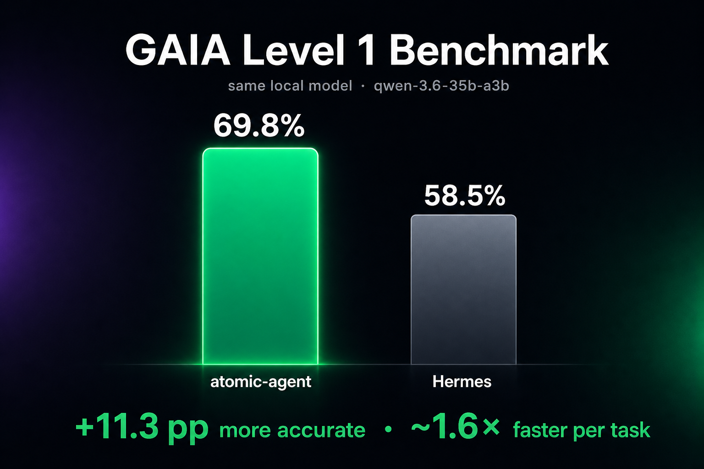
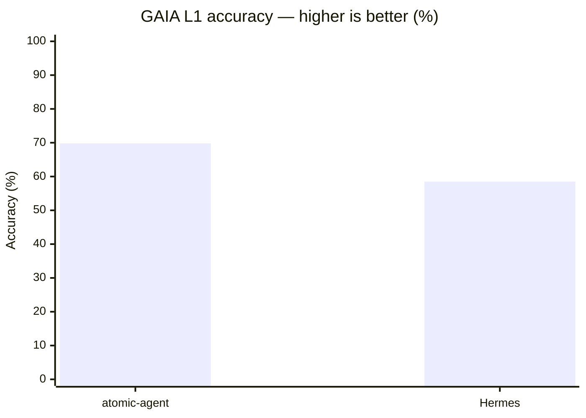
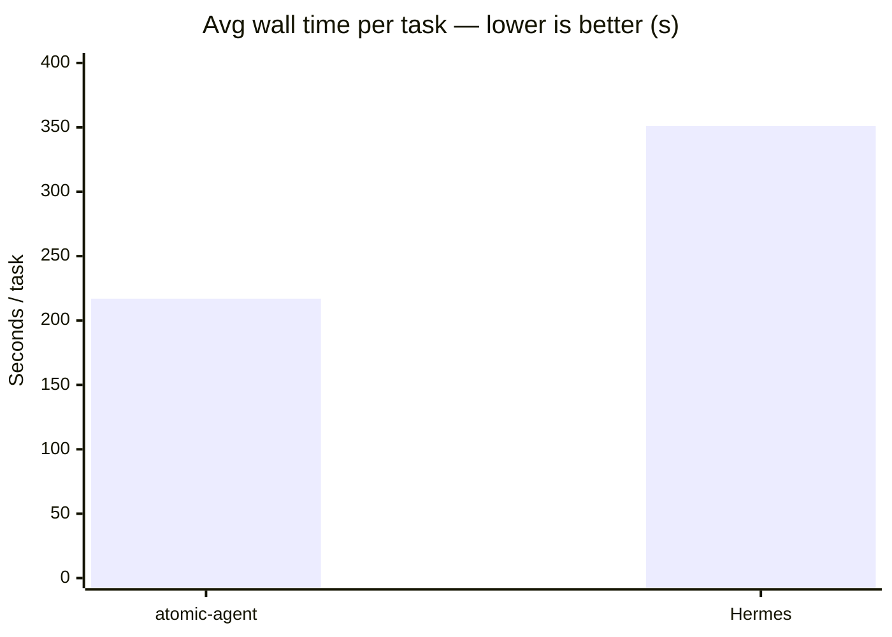

# atomic-agent

**A local-first operator agent runtime for people who want the machine on their desk, not in somebody else's cloud.**


[](https://github.com/AtomicBot-ai/atomic-agent/actions/workflows/release.yml)
[](https://github.com/AtomicBot-ai/atomic-agent/releases)
[](package.json)
[](LICENSE)
[](https://nodejs.org/)
[](https://www.typescriptlang.org/)


`atomic-agent` is a compact agent runtime that can operate a real desktop: browser, files, shell, documents, git, local memory, scheduled work, approvals, traces, Telegram, MCP servers, and Tauri sidecars.

It is built for the OpenClaw / Hermes / OpenCUA class of operator agents, but tuned for local inference: `llama.cpp`, KV-cache reuse, grammar-constrained tool calls, small prompt tails, and inspectable state on your machine.

**Developer Preview / Active Development:** APIs, commands, config, and behavior are still moving. Expect sharp edges, and pin a release if you need a stable integration point.

**Platform availability:** current releases are available for macOS. Linux and Windows builds are coming soon.

## Quick Install/Update

```bash
curl -fsSL https://api.atomicbot.ai/agent-install | sh
```

The installer downloads the release archive, verifies the checksum, and installs the CLI plus runtime assets such as `grammars/`, native prebuilds, and bundled `ripgrep`.

Optional overrides:

```bash
ATOMIC_AGENT_VERSION=v0.1.29       # pin a release
ATOMIC_AGENT_INSTALL_DIR=/opt/bin  # choose install directory
ATOMIC_AGENT_NO_PATH=1             # do not edit shell rc files
ATOMIC_AGENT_REPO=owner/repo       # install from a fork
```

## Why Enthusiasts Care

Most agent products ask you to rent the control plane. Your files, browser context, prompts, traces, tool outputs, and usage patterns move through a hosted service, then the bill follows the token stream.

`atomic-agent` takes the enthusiast route:

- Run the agent loop locally.
- Bring your own `llama-server`, or let the CLI manage one.
- Keep sessions, memory, tasks, traces, skills, browser profile, and config under `<stateDir>`.
- Inspect the prompt, replay trace drift, edit skills, and replace parts without waiting for a vendor.
- Use cloud providers only when you deliberately configure them.

This is for people who like local models, terminal UIs, SQLite files, trace logs, hackable runtimes, and software that can be understood all the way down.

## The Core Idea

A local model can operate software if the runtime stops wasting its context.

`atomic-agent` does not treat the model like an infinite planner. One inference produces one JSON array of tool calls. The runtime executes those calls, compresses the results, updates durable state, and asks the model for the next move.

```text
user message
  -> compact prompt
  -> llama-server completion with tool-call grammar
  -> JSON array of 1..N tool calls
  -> resource-aware execution
  -> compressed results and durable state
  -> repeat until reply, finish, cancel, or max steps
```

The model chooses actions. The runtime owns the loop, the state, the approvals, the traces, and the failure boundaries.

## What Makes It Different

### Local-Model Native

- **Stable prefix:** persona, rules, tools, skills, capabilities, and instructions stay byte-stable inside a session so `cache_prompt` and `slot_id` can reuse KV-cache.
- **Bounded tail:** conversation, memory, world state, recalled notes, lessons, procedures, and loaded skill bodies are clipped into a predictable prompt budget.
- **Externalized state:** sessions, memory, tasks, skills, traces, browser snapshots, and model config live outside the prompt.
- **GBNF tool calls:** completions are constrained into a JSON array of tool calls, including the solo case `[{...}]`.
- **Parallel read batches:** independent read-only calls can run concurrently after a single inference; dangerous actions remain approval-gated.
- **Compact browser view:** ordinary web operation uses accessibility / ARIA snapshots instead of screenshot-heavy page dumps.

This is architecture, not prompt superstition.

### Real Operator Surface

`atomic-agent` can work across the local machine:

- **Browser:** navigate, click, type, inspect tabs, and read compact browser state through `playwright-core` against Chrome, Edge, or another Chromium-family browser.
- **Filesystem and shell:** read, write, patch, glob, grep, archive, hash, inspect processes, use clipboard, send notifications, and run approved commands.
- **Documents:** extract text from PDF, DOCX, DOC, XLSX, RTF, ODT, PPTX, archives, and plain text locally.
- **Git:** status, log, diff, show, blame, and branch inspection.
- **Skills:** Markdown playbooks with optional approved scripts; full skill bodies load only when needed.
- **Memory:** profile facts, notes, hybrid recall, links, lessons, procedures, voting, reflection, and bounded prompt rendering.
- **Tasks:** durable deferred turns, cron schedules, intervals, webhooks, and agent-created reminders.
- **Vision:** optional `vision.describe` for multimodal models with `mmproj`, kept outside the normal text transcript.
- **Providers:** local `llama-server` by default, plus OpenAI-compatible and OpenRouter-style providers for text or embeddings when configured.
- **MCP:** connect external MCP servers and expose their tools, resources, and prompts through the same tool registry.
- **Telegram:** single-user remote control with owner pairing and inline approval buttons.

Dangerous actions are routed through approvals. Read-heavy exploration stays fast.

## Benchmarks



On the public **GAIA validation Level 1** split (53 tasks), `atomic-agent` and
`Hermes` drove the **same** local `qwen-3.6-35b-a3b` (`llama-server`, UD-Q4_K_XL),
with the same step budget and timeout. The only variable is the agent runtime.





| Metric | atomic-agent | Hermes |
|---|---|---|
| **Accuracy** | **37/53 = 69.8%** | 31/53 = 58.5% |
| Avg wall / task | **~217 s** | ~351 s |
| Head-to-head wins | **+15 atomic-only** | +9 Hermes-only |

**atomic-agent: +11.3 pp more accurate, ~1.6× faster per task.**

Full reproducible write-up: [`eval-agents/docs/GAIA-L1-EXPERIMENT.md`](eval-agents/docs/GAIA-L1-EXPERIMENT.md).
Raw artifacts (matrices, NDJSON traces, logs): [gaia-l1-eval-2026-06-11 release](https://github.com/AtomicBot-ai/atomic-agent/releases/tag/gaia-l1-eval-2026-06-11).

## Memory That Feels More Human

`atomic-agent` memory is not a giant chat log pasted back into the prompt. It is shaped more like human memory: durable identity, episodic notes, associations, distilled lessons, reusable procedures, and feedback from experience.

People do not remember by replaying every second of their life. They remember facts about themselves, recall relevant episodes, connect related ideas, learn principles from repeated outcomes, and develop procedures for familiar work. The runtime mirrors that pattern in a bounded, inspectable way:

- **Profile facts** render into `### profile` with contextual keyword gating.
- **Notes** are stored in SQLite + FTS5, optionally paired with embeddings for hybrid recall.
- **Links** connect related memories into a bounded graph.
- **Lessons** distill repeated episodes into reusable principles.
- **Procedures** distill how-to templates without auto-executing them.
- **Voting** lets useful or harmful memories, lessons, procedures, and profile facts drift up or down.
- **Reflection** runs after turns, off the main agent slot, and writes memory without blocking the user-visible reply.

The prompt sees compact pointers, not the whole archive. Full bodies are recalled by tool call when the agent actually needs them, so memory can grow without turning every step into a token dump.

## Product Surfaces

### TUI And CLI

Use the CLI for simple sessions, automation, and debugging. Use the TUI when you want a live operator console for approvals, logs, models, skills, tasks, memory, MCP, Telegram, and traces.

```bash
atomic-agent run --cwd /path/to/work
atomic-agent tui --cwd /path/to/work

atomic-agent skill list
atomic-agent task list
atomic-agent trace list --limit 10
```

### Managed Local Models

The CLI can manage a paired `llama.cpp` setup for chat and embeddings:

```bash
atomic-agent models update
atomic-agent models list
atomic-agent models pull qwen-3.5-4b
atomic-agent models use qwen-3.5-4b
atomic-agent models start

atomic-agent tui --cwd /path/to/work
```

Managed mode downloads the backend, pulls GGUF models, selects the active model, and starts detached chat / embedding daemons when configured.

### External `llama-server`

Already have your own `llama.cpp` process? Point `atomic-agent` at it:

```bash
export ATOMIC_AGENT_LLAMA_URL=http://127.0.0.1:8080

./llama-server -m Qwen2.5-9B-Instruct-Q4_K_M.gguf \
  --slots 4 \
  --parallel 4 \
  --port 8080 \
  --cache-reuse 256

atomic-agent tui --cwd /path/to/work
```

### OpenAI-Compatible HTTP

Run `atomic-agent` as a local HTTP service:

```bash
atomic-agent serve \
  --host 127.0.0.1 \
  --port 8787 \
  --cwd /path/to/work \
  --api-key "$ATOMIC_AGENT_API_KEY"
```

`POST /v1/chat/completions` maps one request to one full macro-turn: `user -> 0..N tool steps -> reply`. Atomic-specific routes expose sessions, approvals, tasks, webhooks, events, traces, config, and capabilities.

### Tauri Sidecar

The sidecar speaks newline-delimited JSON over stdio, making it easy to embed in desktop apps:

```json
{"kind":"request","id":"r-1","type":"start_session","payload":{"workingDir":"/home/me"}}
{"kind":"request","id":"r-2","type":"send_message","payload":{"sessionId":"s-1","text":"Check the inbox and summarize urgent mail."}}
```

Events stream back as the turn runs:

```json
{"kind":"event","id":"e-1","type":"turn_started","correlationId":"r-2","payload":{"sessionId":"s-1","turnIndex":0}}
{"kind":"event","id":"e-2","type":"tool_call_result","correlationId":"r-2","payload":{"sessionId":"s-1","stepIndex":0,"tool":"browser.read_aria","status":"ok","summary":"url: https://mail.google.com/ ..."}}
{"kind":"event","id":"e-3","type":"assistant_reply","correlationId":"r-2","payload":{"sessionId":"s-1","text":"You have 3 urgent threads."}}
```

### Telegram Remote Control

Enable a personal Telegram bot and drive the same runtime from your phone:

```jsonc
// <stateDir>/config.json
{
  "telegram": { "enabled": true, "ownerUserId": null }
}
```

```bash
# <stateDir>/.env
TELEGRAM_BOT_TOKEN=123456789:AA-your-bot-token
```

The TUI can store the token, start the channel, open pairing mode, and show status. Approvals arrive as inline buttons in your DM. Telegram is intentionally single-user.

### MCP Client

Configure MCP servers in `config.json`, and their tools join the same registry as local tools. Trusted read-only servers can batch with other reads; untrusted servers default to approval-gated execution.

```jsonc
{
  "mcp": {
    "servers": [
      {
        "name": "docs",
        "enabled": true,
        "transport": {
          "kind": "stdio",
          "command": "npx",
          "args": ["-y", "@example/mcp-server"]
        },
        "trust": "pure_read"
      }
    ]
  }
}
```

The TUI MCP panel supports live add / remove without restarting the runtime.

## Safety And Observability

Local does not mean opaque. The runtime is built to be inspected and interrupted.

- **Approval gates:** shell, filesystem writes, patches, archive extraction, process kill, HTTP requests, skill scripts, and untrusted MCP tools are gated by policy.
- **Append-only traces:** prompts, completions, tool invocations, outcomes, failure categories, votes, lesson lifecycle events, and procedure events can be recorded as local NDJSON.
- **Prompt drift replay:** `atomic-agent trace replay <sessionId>` compares current stable-prefix hashes against recorded traces.
- **Failure taxonomy:** transport, grammar, model, tool, and cancellation failures are classified across events, traces, metrics, TUI, sidecar, and HTTP.
- **Per-session FIFO:** every surface enters the same `TurnController`; one session stays ordered while different sessions can run concurrently.
- **Explicit state:** sessions, memory, tasks, skills, browser profile, Telegram pointer, MCP config, and traces are ordinary local files or SQLite databases.

Treat traces and `<stateDir>/.env` as sensitive local artifacts. Secret redaction and per-tool environment filtering are not complete isolation layers.

## Privacy And Egress

By default, the runtime does not require a hosted agent provider. Model calls go to your configured backend, and local artifacts stay under `<stateDir>`.

Egress is still explicit and real:

- browser navigation talks to websites;
- HTTP tools talk to requested endpoints;
- configured cloud LLM or embedding providers receive their requests;
- MCP servers receive the tool calls you route to them;
- skills and shell commands inherit the runtime environment.

The promise is not magic secrecy. The promise is that the agent control plane does not need to be remote.

## Requirements

- Node.js for development; release bundles ship as Node SEA binaries.
- A reachable `llama-server`, either managed by `atomic-agent models` or launched externally.
- Chrome, Microsoft Edge, or another configured Chromium-family executable. Browser binaries are not bundled.
- `git` for git tools.
- macOS workflows may need Accessibility, Screen Recording, Automation, or Reminders permissions.
- Linux window-control workflows work best with `wmctrl`.

## Configuration And Secrets

User-facing configuration lives in:

```text
<stateDir>/config.json
```

Useful environment variables:

- `ATOMIC_AGENT_STATE_DIR`: state, config, skills, browser profile, memory, tasks, and traces. Default: `~/.atomic-agent`.
- `ATOMIC_AGENT_LLAMA_URL`: external `llama-server` URL.
- `ATOMIC_AGENT_LLAMA_API_KEY`: optional bearer token for `llama-server`.
- `ATOMIC_AGENT_LLAMA_MAX_TOKENS`: completion cap.
- `ATOMIC_AGENT_BROWSER_CHANNEL`: `chrome`, `msedge`, or `chromium`.
- `ATOMIC_AGENT_BROWSER_EXECUTABLE_PATH`: explicit Chromium-family executable path.
- `ATOMIC_AGENT_BROWSER_CDP_URL`: attach to an already-running browser via CDP.

Secrets for skills and channels belong in `<stateDir>/.env`, not in `config.json`:

```text
NOTION_API_KEY=ntn_xxxxxxxx
GITHUB_TOKEN=ghp_xxxxxxxx
TELEGRAM_BOT_TOKEN=123456789:AA-your-bot-token
OBSIDIAN_VAULT_PATH=/Users/me/Documents/Obsidian Vault
```

Shell-exported variables win over `.env`. The built-in parser intentionally supports only simple `KEY=VALUE` lines.

## What It Is Not

- Not a cloud agent platform.
- Not a hosted IDE coding agent.
- Not a browser distribution.
- Not a model-weight distribution.
- Not a giant-prompt framework.
- Not a hidden multi-agent planner.
- Not a complete secret-redaction or sandbox-isolation system.

The restraint is deliberate: small runtime, explicit state, local control, embeddable protocol.

## Development

```bash
npm install
npm run lint
npm test
npm run build
```

Core docs:

- [PROMPT.md](PROMPT.md) for stable-prefix and variable-tail prompt anatomy.
- [MEMORY.md](MEMORY.md) for profile facts, notes, reflection, and recall.
- [MEMORY_FABRIC_V2.md](MEMORY_FABRIC_V2.md) and [MEMORY_FABRIC_V2.5.md](MEMORY_FABRIC_V2.5.md) for the memory roadmap.
- [SKILLS.md](SKILLS.md) for the local skill format.
- [BUNDLING.md](BUNDLING.md) for release packaging.
- [AGENTS.md](AGENTS.md) for contributor invariants and runtime contracts.

## License

[MIT](LICENSE) (c) 2026 Atomic Bot
