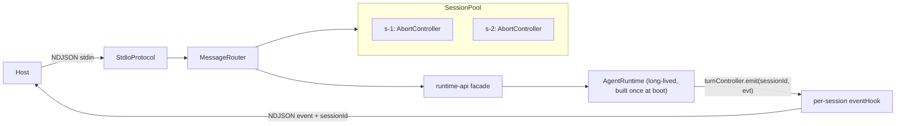

# atomic-agent sidecar protocol (v2) — engineering design

This document is the **source of truth** for the stdio NDJSON protocol between a
host (Tauri desktop app, or any process that spawns the sidecar) and the
`atomic-agent` runtime. It supersedes the flat v1 protocol in
[src/sidecar/sidecar-events.ts](src/sidecar/sidecar-events.ts).

The goal is **feature parity with the Ink TUI** over a single long-lived
sidecar process: multiple concurrent sessions, full event streaming, and
control surfaces for tasks, memory, MCP, skills, providers, Telegram, and
config. Local model daemon management (download/start/stop) stays out of scope —
the sidecar is **external-llama-server only** and exposes model state as
read-only status.

> Status: v2 is a **breaking** redesign. v1 request/event names are removed.
> `atomic-agent` is a developer preview; there is no back-compat shim.

## 1. Design goals and non-goals

Goals:

- One sidecar process hosts **N concurrent sessions** on a single long-lived
  `AgentRuntime`, mirroring the runtime's per-session FIFO + cross-session
  parallelism ([src/runtime/turn-controller.ts](src/runtime/turn-controller.ts)).
- **Namespaced** request/event schema (`session.*`, `chat.*`, `task.*`, ...).
- A shared **runtime-facade** (`src/runtime-api/`) is the single source of
  truth for every operation; both the sidecar router and the HTTP routes call
  it, so the two transports never drift.
- Full forwarding of `AgentLoopEvent` + nested `StepEvent` including the
  variants v1 dropped (`loop_detected`, `prompt_captured`, `parse_retry`,
  `batch_trimmed`, `rare_tool_autoloaded`, non-delta `reasoning`).
- The TypeScript protocol types are exported from the package root so a
  TS/React host imports the same definitions.

Non-goals (deferred):

- Local llama-server daemon lifecycle (download / start / stop) — CLI/TUI only.
- HTTP routes for the new domains (memory / mcp / provider / telegram) — the
  facade is transport-agnostic; HTTP surface can grow later.
- The Tauri UI (React) and the Rust shell themselves.

## 2. Transport and envelope

Framing is unchanged from v1: **newline-delimited JSON** over stdin (host ->
sidecar) and stdout (sidecar -> host). Every frame is a single JSON object
terminated by `\n` ([src/sidecar/stdio-protocol.ts](src/sidecar/stdio-protocol.ts)).

Three message kinds:

```ts
interface HostRequest<TType extends RequestType = RequestType, TPayload = unknown> {
  kind: "request";
  id: string;              // host-generated correlation id
  type: TType;             // namespaced command, e.g. "chat.send"
  payload: TPayload;
}

interface SidecarResponse<TPayload = unknown> {
  kind: "response";
  id: string;              // sidecar-generated
  correlationId: string;   // == HostRequest.id
  ok: boolean;
  payload: TPayload;
  error?: SidecarError;
}

interface SidecarEvent<TType extends EventType = EventType, TPayload = unknown> {
  kind: "event";
  id: string;              // sidecar-generated
  type: TType;             // namespaced event, e.g. "assistant.delta"
  correlationId?: string;  // set to the originating request id when known
  payload: TPayload;       // carries `sessionId` when session-scoped
}
```

Rules:

- Every request gets **exactly one** response (`ok: true` with `payload`, or
  `ok: false` with `error`). Long-running requests (`chat.send`) resolve only
  when the macro-turn terminates; progress arrives as **events** in between.
- Events are fire-and-forget. Session-scoped events carry `sessionId` in the
  payload; when they were triggered by a specific request, `correlationId`
  points back at it.
- Parse failures on an inbound line emit a top-level `error` event
  (`code: "parse_error"`).

## 3. Session model: long-lived runtime + session pool

### v1 (removed)

v1 held `active: ActiveSession | null` and `start_session` tore down the entire
runtime to create the next session
([src/sidecar/main.ts](src/sidecar/main.ts)). Only one session existed per
process; there was no list/switch.

### v2



- The `AgentRuntime` is created **once at boot** via `createAgentRuntime` and
  lives for the whole process. `shutdown` disposes it.
- A `SessionPool` maps `sessionId -> { controller: AbortController }`. Sessions
  are registered on `session.create` / `session.open` and removed on
  `session.delete`. There is no per-session runtime.
- `chat.send` submits through `turnController.enqueue({ sessionId, origin:
  "sidecar", signal, eventHook, run })`. The `eventHook` forwards every
  `AgentLoopEvent` for that session as an NDJSON event tagged with the
  `sessionId` and the request `correlationId`. Because the controller swaps
  hooks atomically at the FIFO boundary, two concurrent sessions never
  cross-contaminate their event streams.
- `chat.cancel` aborts the session's current `AbortController` (a fresh one is
  minted per `chat.send`).

Global runtime handlers that are **not** per-session-hook driven — approval
requests, channel status, logs, metrics, `llm_unavailable` — already carry
`sessionId` in their payload (or are process-global) and are forwarded straight
to stdout.

## 4. Commands (host -> sidecar)

Notation: `type` — payload shape -> response payload shape. All ids are strings
unless noted. Every command may instead resolve with `ok: false` + `error` (see
section 8).

### 4.1 `session.*`

| type | payload | response |
|---|---|---|
| `session.create` | `{ workingDir?: string; metadata?: Record<string, unknown> }` | `{ session: SessionSummary }` |
| `session.list` | `{ limit?: number; workingDir?: string }` | `{ sessions: SessionSummary[] }` |
| `session.get` | `{ sessionId: string }` | `{ session: SessionState \| null }` |
| `session.open` | `{ sessionId: string }` | `{ session: SessionSummary }` — load from SQLite + register in pool |
| `session.delete` | `{ sessionId: string }` | `{ deleted: boolean }` |

- `session.create` backs onto `runtime.createSession`; `workingDir` defaults to
  the runtime's boot working dir.
- `session.list` -> `sessionStore.listRecent(limit)` /
  `sessionStore.listByWorkingDir(workingDir, limit)`.
- `session.get` -> in-pool `SessionState` if resident, else
  `sessionStore.load(id)`.
- `session.open` hydrates a persisted session into the pool so the host can
  resume a past conversation. `SessionState` for `session.get` is returned
  verbatim (JSON blob) so the host can render the full transcript.

`SessionSummary` is a compact projection (avoids shipping the whole transcript
on list):

```ts
interface SessionSummary {
  id: string;
  workingDir: string;
  status: SessionStatus;   // pending | running | ... | stalled
  turnCount: number;
  stepCount: number;
  createdAt: number;
  updatedAt: number;
  lastError: string | null;
  busy: boolean;           // turnController.isBusy(id)
}
```

### 4.2 `chat.*`

| type | payload | response |
|---|---|---|
| `chat.send` | `{ sessionId: string; text: string; maxSteps?: number }` | `{ reason: AgentLoopReason; turnCount: number; stepCount: number }` |
| `chat.cancel` | `{ sessionId: string }` | `{ cancelled: boolean }` |

- `chat.send` enqueues the turn; the response resolves at macro-turn
  termination. Deltas / tool calls / step events stream as events in between
  (section 6). `maxSteps` defaults to `config.agent.maxSteps`.
- `chat.cancel` -> abort the session's current controller.

### 4.3 `approval.*`

| type | payload | response |
|---|---|---|
| `approval.resolve` | `{ approvalId: string; approved: boolean; reason?: string }` | `{ resolved: boolean }` |

Backs onto `runtime.approvals.resolve(...)`. Approval requests arrive as the
`approval.request` event (section 5).

### 4.4 `task.*`

| type | payload | response |
|---|---|---|
| `task.create` | `{ sessionId?: string; userMessage: string; maxSteps?: number; maxAttempts?: number; schedule?: TaskSchedule }` | `{ task: TaskRecord }` |
| `task.list` | `{ sessionId?: string; status?: TaskStatus[]; limit?: number }` | `{ tasks: TaskRecord[] }` |
| `task.get` | `{ taskId: string }` | `{ task: TaskRecord \| null }` |
| `task.cancel` | `{ taskId: string }` | `{ task: TaskRecord \| null }` |
| `task.run` | `{ taskId: string }` | `{ task: TaskRecord \| null }` |
| `task.drain` | `{ sessionId?: string }` | `{ outcome: DrainOutcome }` |

- Backs onto `taskRunner.create` / `taskStore.list|get|cancel` /
  `taskRunner.runOne|drainPending`.
- `TaskSchedule` = `{ kind: "at"; at } | { kind: "cron"; expression; tz? } |
  { kind: "interval"; everyMs }`
  ([src/tasks/task-types.ts](src/tasks/task-types.ts)).
- `TaskRecord` is projected via `recordToJson` (same shape as
  [src/http/route-tasks.ts](src/http/route-tasks.ts)).
- Gated by `config.tasks.enabled`; returns `error.code = "subsystem_disabled"`
  when off.

### 4.5 `memory.*` (read-only)

All read-only — mirrors the TUI Memory tab invariant (no writes over the
protocol; the agent itself mutates memory via tools/reflection).

| type | payload | response |
|---|---|---|
| `memory.profile.list` | `{}` | `{ facts: ProfileFact[] }` |
| `memory.profile.history` | `{ key: string }` | `{ history: ProfileFact[] }` |
| `memory.notes.recall` | `{ query: string; k?: number; scope?: "project" \| "all"; workingDir?: string }` | `{ notes: MemoryEntry[] }` |
| `memory.notes.list` | `{ limit?: number; scope?: "project" \| "all"; workingDir?: string; excludeArchived?: boolean }` | `{ notes: MemoryEntry[] }` |
| `memory.notes.get` | `{ id: number }` | `{ note: MemoryEntry \| null; consolidatedInto: number \| null }` |
| `memory.lessons.list` | `{ limit?: number }` | `{ lessons: LessonIndexEntry[] }` |
| `memory.lessons.get` | `{ id: number }` | `{ lesson: Lesson \| null }` |
| `memory.procedures.list` | `{ limit?: number }` | `{ procedures: ProcedureIndexEntry[] }` |
| `memory.procedures.get` | `{ id: number }` | `{ procedure: Procedure \| null }` |
| `memory.links.list` | `{ limit?: number }` | `{ links: LinkRow[] }` |
| `memory.links.expand` | `{ seedIds: number[]; depth?: number; maxExpanded?: number }` | `{ ids: number[] }` |
| `memory.votes.list` | `{ limit?: number }` | `{ events: VoteEventRow[] }` |

- Notes recall uses `recallHybridAsync`; list uses `list`; get pairs `get(id)`
  with `getConsolidatedInto(id)`.
- `memory.votes.*` returns `error.code = "subsystem_disabled"` when
  `voteStore === null`.

### 4.6 `mcp.*`

| type | payload | response |
|---|---|---|
| `mcp.list` | `{}` | `{ servers: McpServerStatus[]; catalogs: McpServerCatalog[] }` |
| `mcp.add` | `{ config: McpServerConfig }` | `{ added: boolean; tools: McpToolMeta[] }` |
| `mcp.remove` | `{ name: string }` | `{ removed: boolean; tools: string[] }` |
| `mcp.refresh` | `{}` | `{ ok: true }` |

- `mcp.add` -> persist to config + `mcpManager.addServerLive` + `refreshMcp`.
- `mcp.remove` -> persist removal + `mcpManager.removeServerLive` + `refreshMcp`.
  This mirrors the TUI "persist first, then live-mutate" contract from
  [src/tui/mcp/mcp-orchestrator.ts](src/tui/mcp/mcp-orchestrator.ts).
- `mcp.refresh` rebuilds the grammar + tool catalog from the live manager.
- Server state changes emit the `mcp.status` event.

### 4.7 `skill.*`

| type | payload | response |
|---|---|---|
| `skill.list` | `{}` | `{ skills: SkillEntry[] }` |
| `skill.enable` | `{ name: string }` | `{ ok: true }` |
| `skill.disable` | `{ name: string }` | `{ ok: true }` |
| `skill.install` | `{ sourcePath: string; force?: boolean }` | `{ name: string; installedAt: string }` |
| `skill.uninstall` | `{ name: string }` | `{ removed: boolean }` |

- `skill.list` -> `skillRegistry.listAll()` projected as
  `{ name, version, description, source, disabled }`.
- enable/disable mutate `config.skills.disabled` + `skillRegistry.setDisabledNames`
  + `refreshSkills`.
- install/uninstall -> `installSkill` / `uninstallSkill` + `refreshSkills`.
- Registry changes emit `skill.registry_updated`.

### 4.8 `provider.*` and `models.status`

| type | payload | response |
|---|---|---|
| `provider.list` | `{}` | `{ providers: ProviderSummary[]; activeTextId: string }` |
| `provider.setActive` | `{ id: string }` | `{ activeTextId: string }` |
| `provider.reload` | `{ id?: string }` | `{ ok: true }` — one provider or all |
| `provider.remove` | `{ id: string }` | `{ ok: true }` |
| `models.status` | `{}` | `{ status: ModelsStatus }` |

- provider ops -> `providerRegistry.listIds` / `setActive` / `removeProvider`,
  `runtime.reloadLlmProvider(s)`. Provider list is enriched from
  `config.llm.providers` when present.
- `models.status` is **read-only**:

```ts
interface ModelsStatus {
  reachable: boolean;        // checkLlamaServer().reachable
  url: string;               // config.localModels.url
  mode: "external" | "managed";
  latencyMs: number;
  error: string | null;
  activeModelId: string | null;  // ModelProfileManager.getModelId()
  contextWindow: number | null;  // ModelProfile.contextWindow
  capabilities: ProviderCapabilities;  // active text provider
}
```

### 4.9 `telegram.*`

| type | payload | response |
|---|---|---|
| `telegram.get` | `{}` | `{ status: TelegramStatus }` |
| `telegram.setEnabled` | `{ enabled: boolean }` | `{ status: TelegramStatus }` |
| `telegram.restart` | `{}` | `{ status: TelegramStatus }` |
| `telegram.setToken` | `{ token: string \| null }` | `{ status: TelegramStatus }` |
| `telegram.setOwner` | `{ ownerUserId: number \| null }` | `{ status: TelegramStatus }` |
| `telegram.pair` | `{ timeoutMs?: number }` | `{ started: boolean }` |
| `telegram.unpair` | `{}` | `{ ok: true }` — cancel pairing |

```ts
interface TelegramStatus {
  present: boolean;             // telegramChannel !== null
  state: ChannelState;          // up | down | disabled | starting | stopping
  hasToken: boolean;            // never echo the token itself
  ownerUserId: number | null;
  bot: { id: number; username: string | null } | null;
  lastError: string | null;
}
```

- The token value **never** leaves the sidecar; only `hasToken: boolean` is
  reported. `telegram.setToken` accepts the value inbound only.
- Returns `error.code = "subsystem_disabled"` when `telegramChannel === null`.

### 4.10 `config.*`

| type | payload | response |
|---|---|---|
| `config.get` | `{}` | `{ path: string; config: UserConfigFile }` |
| `config.patch` | `{ patch: Partial<UserConfigFile> }` | `{ path: string; config: UserConfigFile }` |

- Backs onto the same logic as
  [src/http/route-config.ts](src/http/route-config.ts). Note the current merge
  only touches `localModels`, `log`, `agent`; in-flight loops keep the old
  `getConfig()` until restart. This limitation is documented, not changed here.

### 4.11 process

| type | payload | response |
|---|---|---|
| `ping` | `{}` | `{ ok: true; llamaUrl: string; stateDir: string; version: string; protocolVersion: number }` |
| `shutdown` | `{}` | `{ ok: true }` — dispose runtime, close stores |

## 5. Events (sidecar -> host)

Session-scoped events carry `sessionId`. Turn/step/tool/assistant/reasoning
events also carry the `correlationId` of the originating `chat.send`.

### 5.1 Session lifecycle

| type | payload |
|---|---|
| `session.created` | `{ session: SessionSummary }` |
| `session.opened` | `{ session: SessionSummary }` |
| `session.deleted` | `{ sessionId: string }` |

### 5.2 Turn / step (from `AgentLoopEvent`)

| type | payload | source variant |
|---|---|---|
| `turn.started` | `{ sessionId; turnIndex }` | `turn_started` |
| `turn.finished` | `{ sessionId; turnIndex; reason; stepCount; durationMs }` | `turn_finished` |
| `step.started` | `{ sessionId; stepIndex }` | `step_started` |
| `step.finished` | `{ sessionId; stepIndex; summary; durationMs }` | `step_finished` |
| `loop.detected` | `{ sessionId; tool; count; stepIndex; level?; detector? }` | `loop_detected` |
| `session.completed` | `{ sessionId; reason }` | `loop_completed` (`finish`/`max_steps`) |
| `session.failed` | `{ sessionId; error; category }` | `loop_failed` |

`AgentLoopReason` = `"reply" | "finish" | "max_steps" | "cancelled" | "failed"`.

### 5.3 Step-level (from nested `StepEvent` via `llm_event`)

| type | payload | source variant |
|---|---|---|
| `user.message` | `{ sessionId; text }` | `user_message` |
| `assistant.reply` | `{ sessionId; text }` | `assistant_reply` |
| `assistant.delta` | `{ sessionId; text }` | `assistant_delta` |
| `reasoning.delta` | `{ sessionId; stepIndex; text }` | `reasoning_delta` |
| `reasoning` | `{ sessionId; stepIndex; text }` | `reasoning` (non-delta) |
| `tool.call_started` | `{ sessionId; stepIndex; tool; args; batchIndex?; batchSize? }` | `tool_call_parsed` |
| `tool.call_result` | `{ sessionId; stepIndex; tool; status; summary; truncated?; batchIndex?; batchSize? }` | `tool_call_executed` |
| `tool.autoloaded` | `{ sessionId; tool; source; stepIndex }` | `rare_tool_autoloaded` |
| `prompt.captured` | `{ sessionId; stepIndex; stablePrefixHash; tokens; slotId; cacheReused }` | `prompt_captured` |
| `parse.retry` | `{ sessionId; stepIndex; attempt; reason }` | `parse_retry` |
| `batch.trimmed` | `{ sessionId; stepIndex; originalSize; kept; dropped; reason }` | `batch_trimmed` |

Note: `prompt.captured` omits the raw prompt tail by default (hash + token
counts only) to keep the stream compact. A future `verbose` flag can opt in.

### 5.4 Cross-cutting

| type | payload |
|---|---|
| `approval.request` | `{ approvalId; sessionId; tool; reason; preview?; affectedResources? }` |
| `channel.status` | `{ channel; state; lastError? }` |
| `mcp.status` | `{ servers: McpServerStatus[] }` |
| `skill.registry_updated` | `{ installed: Array<{ name; source }> }` |
| `task.updated` | `{ task: TaskRecord }` (best-effort, when task lifecycle transitions) |
| `llm.unavailable` | `{ url; error; mode; hint }` |
| `log` | `{ level; message; context? }` |
| `metric` | `{ name; value; tags? }` |
| `error` | `{ message; code?; stack? }` |

## 6. Streaming contract

Streaming already exists in the runtime — `assistant_delta` and
`reasoning_delta` are emitted mid-step, followed by a terminal `assistant_reply`
with the full text ([src/agent/step-events.ts](src/agent/step-events.ts)). The
protocol carries them verbatim, routed per session.

Lifecycle of one `chat.send`:

```
-> request  chat.send { sessionId, text }
<- event    turn.started
<- event    step.started (stepIndex 0)
<- event    reasoning.delta * N        (optional, thinking models)
<- event    assistant.delta * N        (streamed reply tokens)
<- event    tool.call_started / tool.call_result   (when the step calls tools)
<- event    step.finished
   ... more steps ...
<- event    assistant.reply { text }   (terminal, full reply)
<- event    turn.finished { reason: "reply", ... }
<- response chat.send { reason, turnCount, stepCount }
```

Host accumulation rules:

- Concatenate `assistant.delta.text` into a per-`(sessionId, turn)` buffer.
- On `assistant.reply`, either replace the buffer with the authoritative full
  text or diff against the accumulated buffer (they must match). Prefer
  replacing.
- Streaming requires the provider's `completeStream` path (default for
  llama-server). Transport is irrelevant; deltas are plain events.

## 7. Approval flow

- `chat.send` submits with `origin: "sidecar"`. Approval requests fan out
  through the global `onApprovalRequest` runtime handler and are forwarded as
  the `approval.request` event (carries `sessionId`).
- The host replies with `approval.resolve { approvalId, approved, reason? }` ->
  `runtime.approvals.resolve(...)`.
- Multi-session note: `ApprovalRequest.sessionId` disambiguates which
  conversation the request belongs to. The sidecar does not use
  `setApprovalHandlerForSession` — the single global fallback handler is
  sufficient because every request already carries its `sessionId` and every
  `approvalId` is unique.

## 8. Error model

Responses with `ok: false` carry:

```ts
interface SidecarError {
  message: string;
  code?: string;    // machine-readable category
  field?: string;   // for validation errors (e.g. task schedule field)
}
```

Canonical `code`s:

| code | meaning |
|---|---|
| `unknown_request` | no handler for the request type |
| `handler_failed` | unexpected error inside a handler |
| `not_found` | session / task / entity id unknown |
| `subsystem_disabled` | feature gated off (tasks / votes / telegram) |
| `invalid_request` | validation failure (bad args / schedule) |
| `parse_error` | inbound line was not valid JSON (emitted as `error` event) |

Handler exceptions are caught by the router, converted to `ok: false`
responses, and additionally surfaced as an `error` event
([src/sidecar/message-router.ts](src/sidecar/message-router.ts)) — this
behaviour is preserved.

## 9. Runtime-facade layout (`src/runtime-api/`)

Pure functions/classes over `AgentRuntime`, returning JSON-serializable results
and throwing typed `RuntimeApiError` (mapped to `SidecarError` by the router
and to OpenAI-style errors by HTTP). One module per domain:

| module | backs |
|---|---|
| `session-service.ts` | `createSession`, `sessionStore.*`, `turnController.enqueue`, `executeTurn` |
| `task-service.ts` | `taskRunner.*`, `taskStore.*` (logic lifted from `route-tasks.ts`) |
| `memory-service.ts` | `profileStore` / `notesStore` / `lessonStore` / `procedureStore` / `linkStore` / `voteStore` reads |
| `mcp-service.ts` | `mcpManager.*` + `persistMcpServer` / `removeMcpServer` + `refreshMcp` |
| `skill-service.ts` | `skillRegistry`, `installSkill`, `uninstallSkill`, `refreshSkills` |
| `provider-service.ts` | `providerRegistry.*`, `reloadLlmProvider(s)` |
| `models-service.ts` | `checkLlamaServer`, `ModelProfileManager`, active provider capabilities |
| `telegram-service.ts` | `telegramChannel.*` |
| `config-service.ts` | `getConfig`, `ensureUserConfigFileSync`, `mergeUserConfig`, `resetConfigCache` |

Each service takes an `AgentRuntime` (or the specific stores it needs) as an
explicit argument — no global singletons. `index.ts` re-exports named service
functions. The sidecar router and HTTP handlers are thin adapters that (a)
validate/parse the transport payload, (b) call the facade, (c) serialize the
result or the error.

## 10. HTTP migration

Overlapping HTTP routes are migrated to call the facade in the same phase they
land, so the two transports share one implementation:

- [src/http/route-tasks.ts](src/http/route-tasks.ts) -> `task-service`.
- [src/http/route-skills.ts](src/http/route-skills.ts) -> `skill-service`.
- [src/http/route-sessions.ts](src/http/route-sessions.ts) -> `session-service`.
- [src/http/route-config.ts](src/http/route-config.ts) -> `config-service`.
- [src/http/route-approval.ts](src/http/route-approval.ts) -> resolve via facade.

New domains (memory / mcp / provider / telegram / models) are facade-first;
adding HTTP routes for them is optional future work.

## 11. Type export and versioning

- The v2 protocol types live in `src/sidecar/protocol/` (split by domain to stay
  under the 300-line file cap) and are re-exported from
  [src/sidecar/index.ts](src/sidecar/index.ts) and the package root
  (`package.json#main`), so a TS/React host does
  `import type { HostRequest, SidecarEvent } from "atomic-agent"`.
- `PROTOCOL_VERSION` constant is bumped on every breaking change and returned by
  `ping`. v2 starts at `2`.

## 12. Locked invariants

1. One long-lived `AgentRuntime`; `session.*` never rebuilds it.
2. Every turn enters `turnController.enqueue` — per-session FIFO +
   cross-session parallelism are inherited, never re-implemented.
3. The facade is the single source of truth; sidecar and HTTP are thin
   transport adapters with no business logic.
4. Streaming deltas route per session via the per-turn `eventHook`; no global
   fan-out mixes sessions.
5. The runtime never starts a llama-server; `models.status` is read-only.
6. The Telegram token never leaves the sidecar (only `hasToken`).
7. Memory over the protocol is read-only.
8. The stable prompt prefix is untouched by any protocol operation.
