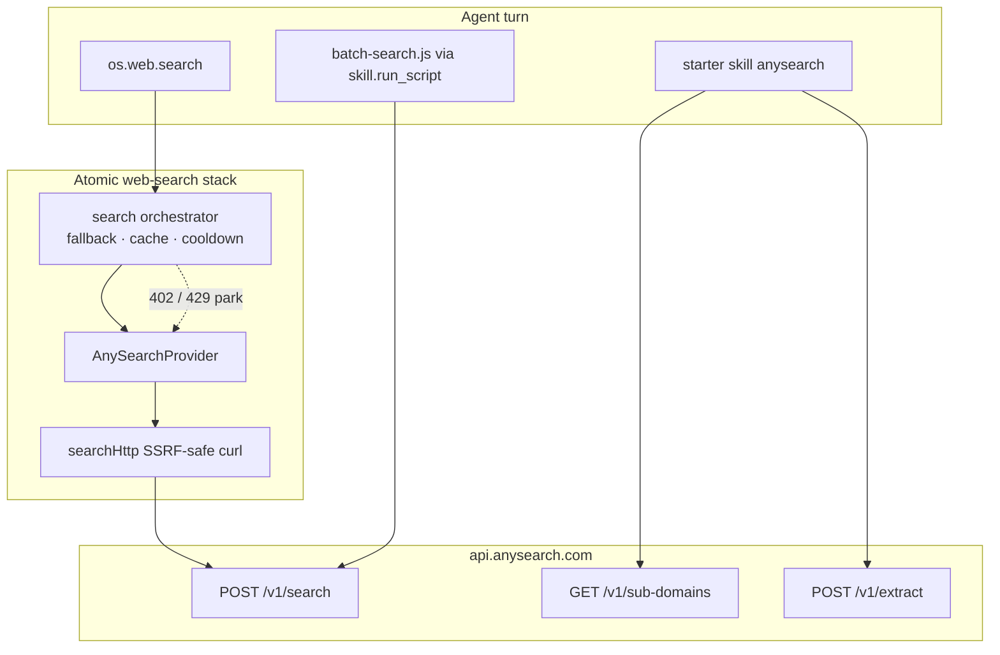

# AnySearch integration (maintenance)

This document describes how Atomic Agent integrates
[AnySearch](https://anysearch.com) for maintainers and bounty reviewers.

Peer patterns consulted while shaping this work:

| Peer | What we borrowed |
|---|---|
| [QwenPaw #7081](https://github.com/agentscope-ai/QwenPaw/pull/7081) (anysearch-ai) | Opt-in provider, anonymous+keyed, empty-Bearer guard, MCP env-ref hygiene |
| [AnythingLLM #6058](https://github.com/Mintplex-Labs/anything-llm/pull/6058) (You.com) | Keyless-default + optional key, shared result shape, test evidence |
| [OpenClaw #47541](https://github.com/openclaw/openclaw/pull/47541) (pluggable search) | Strip `user:pass@` from result URLs, clamp `maxResults`, redact errors |
| [Hermes #41161](https://github.com/NousResearch/hermes-agent/issues/41161) | Discover-then-route, zone/language, extract + MCP notes |
| Official [anysearch-skill](https://github.com/anysearch-ai/anysearch-skill) / MCP | Batch, extract, `auto_registered` key etiquette, untrusted content |
| AutoGPT / HyperResearcher / GPT-Researcher | Parallel batch + isolated per-query failure |

## Architecture



Routing extras (`tag`, `params` JSON string, `zone`, `language`) travel on
`os.web.search` only when present; Exa/Brave/DDG/SearXNG ignore them.

## What shipped

| Surface | Path | Role |
|---|---|---|
| `os.web.search` provider | `src/tools/os/web-search/providers/anysearch-provider.ts` | Anonymous/keyed general + vertical-routed search |
| Tool args | `tag` / `params` / `zone` / `language` on `os.web.search` | First-class vertical routing (other providers ignore) |
| Starter skill | `starter-skills/anysearch/` | Sub-domain discovery, parallel `batch-search.js`, extract, MCP notes |
| Config | `web.search.anysearch.{endpoint,apiKeyEnv,zone,language}` | Defaults + optional region/language |
| Docs | this file + README secrets section | Operator enablement |

## Advantages (operator-facing)

- **Anonymous access** — works without an API key at lower rate limits
- **Vertical domains** — structured search across code, finance, academic, …
- **Parallel batch** — up to 5 queries via `skill.run_script` / `batch-search.js`
- **Extract** — full-page Markdown via `/v1/extract`
- **No new cloud** — uses hosted `https://api.anysearch.com` (no self-hosting)

## Why this shape

Atomic already owns web search through the provider contract (Exa, DuckDuckGo,
Brave, SearXNG). Adding AnySearch as another provider stays merge-friendly:
same SSRF-safe `searchHttp`, fallback, cooldown, and cache stack. Extending
`os.web.search` with optional routing fields mirrors OpenClaw without a new
tool name. Discovery, true parallel batch, and extract that do not fit the
shared contract live in the auto-seeded starter skill (Hermes / HyperResearcher).

## Enable for users

1. **Select the provider** (a key alone does **not** auto-select it):

```json
{
  "web": {
    "search": {
      "provider": "anysearch",
      "fallback": ["duckduckgo"],
      "anysearch": {
        "zone": null,
        "language": null
      }
    }
  }
}
```

Or keep Exa as primary and add `"anysearch"` to `fallback`.

2. **Optional key** — `<stateDir>/.env`:

```
ANYSEARCH_API_KEY=as_sk_…
```

3. **Vertical example** (`params` is a JSON object *string* so the tool
   schema stays OpenAI-strict convertible):

```json
{
  "tool": "os.web.search",
  "args": {
    "query": "Go context cancellation",
    "tag": "code.doc",
    "params": "{\"library\":\"golang\"}",
    "maxResults": 5
  }
}
```

4. **Optional MCP** — `https://api.anysearch.com/mcp` (Streamable HTTP).

## Hardening notes

- HTTP **402** quota → `WebSearchRateLimitedError` (orchestrator parks / falls back)
- Bearer / `as_sk_*` / URL-userinfo redacted from surfaced error strings
- Result URLs strip embedded `user:pass@` (OpenClaw-style) before they reach the model
- Cache keys include `tag` / `params` / `zone` / `language` extras
- Authenticated calls never silently fall back to anonymous on 401
- Empty / whitespace `ANYSEARCH_API_KEY` never sends `Authorization: Bearer ` (QwenPaw)

## API surface

| Method | Path | Used by |
|---|---|---|
| `POST` | `/v1/search` | Provider + skill + batch script |
| `GET` | `/v1/sub-domains` | Skill |
| `POST` | `/v1/extract` | Skill |
| `POST` | `/v1/auth/email/register` | Skill (optional) |

Client headers: `atomic-agent/web-search`, `atomic-agent/skill`,
`atomic-agent/skill-batch`.

## Live call evidence (desensitised)

Per the AnySearch attachment *内置接入资料与审查清单* §5 —
real HTTP against `api.anysearch.com`, anonymous (no `Authorization` header),
no API key in env. Same request shape the built-in provider sends.

| Field | Value |
|---|---|
| When | `2026-09-24T17:27:44+08:00` (general), `2026-09-24T17:27:55+08:00` (vertical) |
| Commit | `e3ee50d1` on `feat/anysearch-integration` (PR #484) |
| Entry | Built-in REST path equivalent to `os.web.search` with `web.search.provider = "anysearch"` |
| Auth | Anonymous — `X-Anysearch-Client: atomic-agent/web-search` only |
| Endpoint | `POST https://api.anysearch.com/v1/search` |

### A. General search

Request body (no secrets):

```json
{"query":"React useEffect cleanup","max_results":3}
```

Response: `HTTP 200`, `code: 0`, `request_id: 73cb0836-00d4-4534-8aa4-69af4ec1467e`, **3** results delivered to the client shape (`title` / `url` / `snippet`), e.g.:

1. [useEffect](https://react.dev/reference/react/useEffect)
2. [Whats the purpose of cleanup function in useEffect?](https://www.reddit.com/r/reactjs/comments/prvg2k/whats_the_purpose_of_cleanup_function_in_useeffect/)
3. [Understanding React's useEffect cleanup function](https://blog.logrocket.com/understanding-react-useeffect-cleanup-function/)

### B. Vertical (`code.doc`)

Request body:

```json
{
  "query": "Go context cancellation documentation",
  "tag": "code.doc",
  "params": { "library": "golang" },
  "max_results": 2,
  "zone": "intl",
  "language": "en"
}
```

Response: `HTTP 200`, `code: 0`, `request_id: ccff0b26-1ab4-4645-9ffd-27d66402814c`, **2** results:

1. [Canceling in-progress operations](https://go.dev/doc/database/cancel-operations)
2. [context - Go Packages](https://pkg.go.dev/context)

### Guide checklist notes

- Empty result vs error: non-zero `code` throws (keeps `request_id` in the message); empty `data.results` returns `[]`.
- Keyless path confirmed: no `Authorization` header on either call.
- Appendix verticals: protocol-level passthrough via `tag`/`params`; live smoke covers general + `code.doc` only — other sub-domains are **未验证 / 本次不逐源验收**.

## Tests

```sh
npx vitest run src/tools/os/web-search/providers/anysearch-provider.test.ts
npx vitest run src/tools/os/web-search/tool/warn-missing-search-key.test.ts
npx vitest run src/tools/os/web-search/providers/search-orchestrator.test.ts
```

## File map

- `src/tools/os/web-search/providers/anysearch-provider.ts`
- `src/tools/os/web-search/tool/web-search-tool.ts`
- `src/tools/os/web-search/transport/search-cache.ts` (`buildSearchCacheExtras`)
- `src/config/config-schema.ts`
- `starter-skills/anysearch/SKILL.md`
- `starter-skills/anysearch/scripts/batch-search.js`
- `docs/anysearch.md`

## Bounty checklist

Official acceptance bar (GitHub, not email):
[anysearch-team/open-source-bounty `docs/rules.zh.md`](https://github.com/anysearch-team/open-source-bounty/blob/main/docs/rules.zh.md)
· [English `docs/rules.md`](https://github.com/anysearch-team/open-source-bounty/blob/main/docs/rules.md)
(“什么样的合入可以获得奖励？” / “What Qualifies for a Bounty?”).

- [x] Built-in provider + seeded skill + docs
- [x] General search (anonymous + keyed)
- [x] Vertical domain search (tool args + discovery)
- [x] Parallel batch (`batch-search.js`)
- [x] Extract
- [x] Markdown maintenance doc
